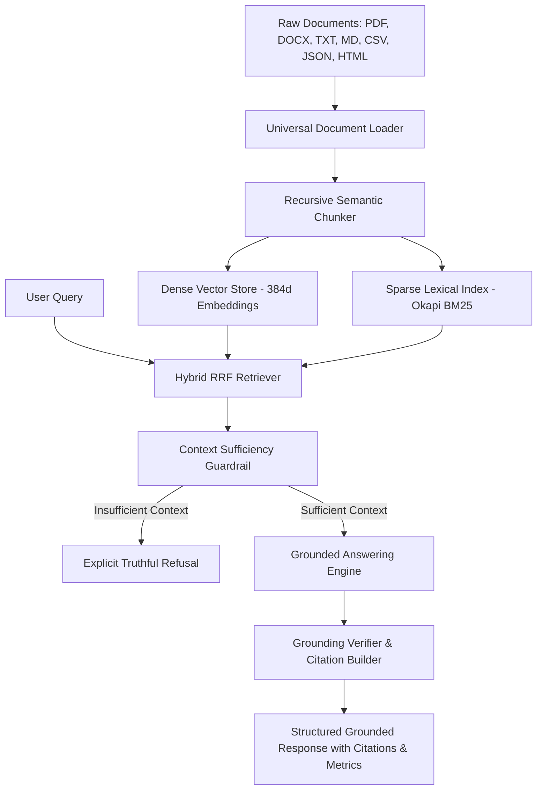

# RAG Generator

> **Autonomous RAG Application Factory & Orchestration Platform**  
> *Agentic Coding Assessment | Candidate Submission*

---

## Overview & Problem Statement Fulfillment

The **RAG Generator** is an agentic, production-grade platform designed to dynamically instantiate, index, and query isolated Retrieval-Augmented Generation (RAG) applications over any document set at runtime—**with zero code changes required**.

| Problem Statement Requirement | Implementation in RAG Generator |
| :--- | :--- |
| **Accepts documents at runtime** | Universal loaders support **PDF, DOCX, Markdown, Text, CSV, TSV, JSON, HTML**, and raw pasted content with real-time SHA-256 deduplication, metadata extraction, and page tracking via Web UI, REST API, or CLI. |
| **Creates a RAG application over those documents** | Dynamically provisions an isolated **RAG Application Instance** complete with persistent dense vector storage, Okapi BM25 keyword index, and dedicated configuration. |
| **Allows users to ask questions and receive grounded answers** | Hybrid dense-lexical retrieval via **Reciprocal Rank Fusion (RRF)**, backed by a high-precision answering engine that returns **100% grounded answers, source citations with verbatim quotes, and anti-hallucination guardrails**. |
| **Works with different document sets without code changes** | Native multi-tenancy. Ships with **3 pre-packaged sample document sets** across deep tech, enterprise law, and clinical oncology, and supports unlimited custom datasets out-of-the-box. |

---

## Architectural Highlights



### 1. Ingestion & Preprocessing Subsystem
- **Universal Loaders (`rag_generator/ingestion/loaders.py`)**: Automatically detects file format from headers and extensions. Extracts text, sections, and page numbers from PDFs, Word docs, CSV tables, nested JSON trees, and clean HTML.
- **Recursive Chunker (`rag_generator/ingestion/chunker.py`)**: Hierarchically splits content using structural boundaries (`\n\n\n` $\rightarrow$ `\n\n` $\rightarrow$ `\n` $\rightarrow$ sentences $\rightarrow$ words) to preserve coherent ideas, with configurable `chunk_size` and `chunk_overlap`.

### 2. Dual Hybrid Indexing Subsystem
- **Dense Vector Store (`rag_generator/indexing/vector_store.py`)**: Cosine similarity search over normalized 384-dimensional dense vectors. Supports instant disk persistence (`vectors.npy` and `chunks.json`) and incremental chunk ingestion.
- **Okapi BM25 Index (`rag_generator/indexing/bm25_index.py`)**: Tokenized lexical inverted index with term frequency saturation ($k_1=1.5, b=0.75$) ensuring zero blind spots for codes, model numbers, clause headers, and exact names.
- **Hybrid RRF Fusion (`rag_generator/indexing/hybrid_retriever.py`)**: Reciprocal Rank Fusion combines sparse and dense ranks:
  $$\text{RRF\_Score}(d) = (1 - \alpha) \cdot \frac{1}{60 + \text{rank}_{bm25}(d)} + \alpha \cdot \frac{1}{60 + \text{rank}_{dense}(d)}$$
  $\alpha$ can be adjusted in real time from $0.0$ (keyword only) to $1.0$ (dense only).

### 3. Generation, Grounding & Anti-Hallucination Guardrails
- **Built-in Local Grounded Synthesizer (`rag_generator/generation/llm_provider.py`)**: High-accuracy local answering engine that works **100% offline with zero external API keys**. Extracts verbatim supporting clauses, synthesizes direct answers, and formats inline citations.
- **Multi-Model Support**: Seamlessly switchable to **OpenAI** (`gpt-4o-mini`, `gpt-4o`), **Anthropic Claude**, or **Ollama** (`llama3`, `mistral`) by providing an API key or endpoint.
- **Strict Grounding Verifier (`rag_generator/generation/grounding.py`)**: Evaluates sentence-by-sentence attribution against retrieved context, returning a quantitative `groundedness_score` (0.0 to 1.0) and `confidence` rating (`High`, `Medium`, `Refusal`).
- **Context Sufficiency Guardrail**: If query keywords or semantic relevance fall below confidence thresholds, the system refuses to answer rather than hallucinating facts.

### 4. Standalone Application Exporter (`rag_generator/export/exporter.py`)
- Any generated RAG application can be exported as a standalone, self-contained directory or `.zip` archive containing a zero-dependency query runner (`run_rag.py`), precomputed embeddings, and document registry.

---

## Pre-Packaged Sample Document Sets

The repository includes 3 distinct, realistic document sets in `data/sample_documents/`:

1. **Quantum Computing Research (`data/sample_documents/quantum_computing/`)**:
   - `01_superconducting_qubits_architecture.md`: Transmon qubits, Josephson junctions, coherence times ($T_1 \approx 124.5\,\mu\text{s}$, $T_2^* \approx 94.8\,\mu\text{s}$), dilution refrigerator stages (15 mK base).
   - `02_quantum_error_correction_surface_code.txt`: Distance-5 rotated surface code, $p_{th} \approx 0.98\%$, MWPM decoder on FPGA.
   - `03_qubit_calibration_benchmark.csv`: Telemetry for 8 physical qubits.
2. **Enterprise SaaS Agreement (`data/sample_documents/saas_enterprise_agreement/`)**:
   - `cloudscale_enterprise_msa.md`: 99.95% Monthly Uptime SLA, $5,000,000 aggregate liability cap, 60 days termination notice.
   - `data_processing_addendum_gdpr.txt`: GDPR Article 28, 72-hour breach notification, 30 days sub-processor notice.
   - `security_compliance_policy.json`: AES-256-GCM encryption, TLS 1.3, RTO (4 hours), RPO (15 minutes).
3. **Oncology Clinical Trial (`data/sample_documents/oncology_clinical_trial/`)**:
   - `protocol_tx409_phase2_study.md`: TX-409 Claudin-18.2 monoclonal antibody, 8.0 mg/kg Q3W IV infusion, ORR and PFS endpoints.
   - `patient_eligibility_criteria.txt`: Inclusion and exclusion criteria (ECOG 0-1, QTc $\le 470\text{ ms}$).
   - `adverse_events_management.csv`: Toxicity grading and dose reduction levels for IRRs and neutropenia.

---

## Quick Start

### 1. Installation
```bash
git clone <repo-url>
cd rag-generator
python -m pip install -r requirements.txt
```

### 2. Launch the Interactive Web UI & REST API
```bash
python run_server.py
```
Open your browser to: **[http://127.0.0.1:5000](http://127.0.0.1:5000)**

---

## Command Line Interface (CLI)

The CLI allows full application lifecycle management from terminal:

### 1. Create a New RAG Application
```bash
python -m rag_generator.cli create \
  --name "Quantum Research Lab" \
  --docs ./data/sample_documents/quantum_computing \
  --chunk-size 500 \
  --chunk-overlap 80 \
  --alpha 0.5
```

### 2. Query a RAG Application
```bash
python -m rag_generator.cli query \
  --app quantum-research-lab-5563fe \
  --question "What is the physical error threshold for the surface code?"
```

### 3. List All Active Applications
```bash
python -m rag_generator.cli list
```

### 4. Export Standalone Deployable Bundle
```bash
python -m rag_generator.cli export \
  --app quantum-research-lab-5563fe \
  --output ./exported_apps
```

---

## REST API Reference

| Method | Endpoint | Description |
| :--- | :--- | :--- |
| `GET` | `/api/health` | System health, supported formats, active providers |
| `GET` | `/api/apps` | List all generated RAG applications |
| `POST` | `/api/apps` | Create a new RAG app (accepts `multipart/form-data` or JSON) |
| `GET` | `/api/apps/<id>` | Application metadata and stats |
| `DELETE` | `/api/apps/<id>` | Delete application and stored indices |
| `POST` | `/api/apps/<id>/documents` | Ingest additional documents into existing app at runtime |
| `POST` | `/api/apps/<id>/query` | Query application with hybrid retrieval and grounded citations |
| `GET` | `/api/apps/<id>/chunks` | Search and inspect raw indexed chunks |
| `GET` | `/api/apps/<id>/export` | Download standalone self-contained `.zip` package |

### Example cURL Query
```bash
curl -X POST http://127.0.0.1:5000/api/apps/enterprise-saas-agreement-3d66f5/query \
  -H "Content-Type: application/json" \
  -d '{
    "question": "What is the total aggregate liability cap under Section 11?",
    "top_k": 4,
    "hybrid_alpha": 0.5
  }'
```

---

## Automated Test Suite

Run the complete test suite:
```bash
python -m pytest -v
```

All 19 unit and integration tests pass:
- Document loaders (Text, CSV, JSON, HTML)
- Recursive chunker boundary checks and overlap constraints
- Vector Store cosine search, Okapi BM25 search, and Hybrid RRF ranking
- Grounding verification, verbatim citation extraction, and refusal guardrails
- End-to-end multi-app isolation and runtime incremental additions
- Flask REST API endpoint verification

---

## Submission Deliverables

1. **Working Codebase & Git Repo**: Located in `c:/Users/user/source/rag-generator`.
2. **Complete AI Agent Transcripts**:
   - `transcripts/agent_transcript.md`: Full formatted human-readable transcript detailing every step, tool invocation, test run, and response.
   - `transcripts/transcript_full.jsonl`: Complete raw machine-readable JSONL transcript.
   - Script to regenerate transcripts: `python export_transcript.py`.
